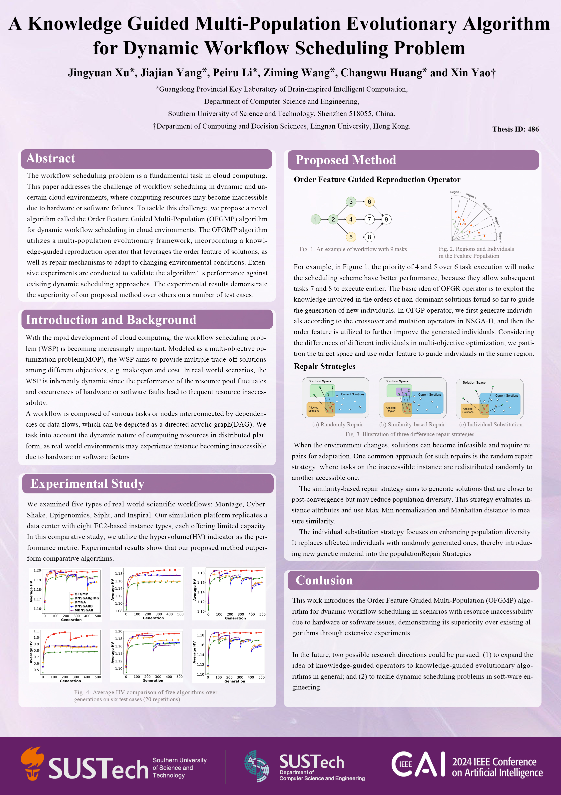

# Semester Group Project
Group members:
`Jingyuan XU`,`Jiajian YANG`,`Peiru LI`
> All members were with equal contribution

Paper: Xu J, Yang J, Li P, et al. (2024, June). A Knowledge Guided Multi-Population Evolutionary Algorithm for Dynamic Workflow Scheduling Problem. In 2024 IEEE Conference on Artificial Intelligence (CAI), pp. 21-28. IEEE. 25-27 June 2024, Singapore. DOI: 10.1109/CAI59869.2024.00014

# Poster Presentation

